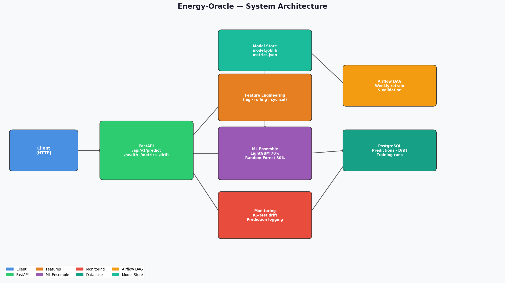

# Energy-Oracle

[](https://github.com/atharvadevne123/Energy-Oracle/actions/workflows/ci.yml)
[](https://python.org)
[](LICENSE)
[](https://fastapi.tiangolo.com)
[](https://lightgbm.readthedocs.io)

> Real-time energy consumption prediction API using a blended LightGBM + RandomForest ensemble with 26 time-series features, KS-test drift detection, automated retraining, and PostgreSQL-backed prediction logging.

---

## Overview

Energy-Oracle predicts hourly energy consumption (kWh) for four zone types — **residential**, **commercial**, **industrial**, and **mixed** — using weather data and temporal context.

**Key capabilities:**

| Feature | Detail |
|---|---|
| ML ensemble | LightGBM (70%) + RandomForest (30%) blend |
| Feature engineering | 26 features: lag, rolling, cyclical, ratio |
| Cross-validation | 5-fold CV with RMSE tracking |
| Drift detection | KS-test on temperature, humidity, predicted_kwh |
| API | FastAPI `/predict` · `/batch` · `/health` · `/health/deep` · `/metrics` · `/drift` · `/version` |
| Storage | SQLite (dev) → PostgreSQL (prod) via SQLAlchemy |
| Retraining | Airflow DAG (weekly) with RMSE threshold guard |
| Observability | Correlation ID tracing · rate limiting · structured JSON logs |

---

## Architecture



---

## Quick Start

### Local (without Docker)

```bash
git clone https://github.com/atharvadevne123/Energy-Oracle.git
cd Energy-Oracle
pip install -r requirements.txt
cp .env.example .env

# Train initial model on synthetic data
make train

# Start API server
make run
# → http://localhost:8000/api/v1/docs
```

### Docker Compose

```bash
docker-compose up -d
# API: http://localhost:8000
# DB:  localhost:5432 (oracle / oracle_pass)
```

---

## API Reference

### `POST /api/v1/predict`

Predict energy consumption for a single zone.

**Request body:**
```json
{
  "zone": "residential",
  "hour": 18,
  "day_of_week": 1,
  "temperature": 28.5,
  "humidity": 62.0
}
```

**Response:**
```json
{
  "predicted_kwh": 31.4872,
  "zone": "residential",
  "hour": 18,
  "day_of_week": 1,
  "model_version": "1.1.0",
  "correlation_id": "f4a3b2c1-..."
}
```

| Field | Type | Constraints |
|---|---|---|
| `zone` | string | `residential` \| `commercial` \| `industrial` \| `mixed` |
| `hour` | int | 0–23 |
| `day_of_week` | int | 0 (Mon) – 6 (Sun) |
| `temperature` | float | −20 to 50 °C |
| `humidity` | float | 0–100 % |

### `POST /api/v1/batch`

Vectorized bulk prediction for up to **1 000 records** in a single request. All valid records are scored in one model call — no per-row overhead.

**Request body:**
```json
{
  "records": [
    {"zone": "residential", "hour": 8, "day_of_week": 1, "temperature": 20.0, "humidity": 55.0},
    {"zone": "commercial",  "hour": 12, "day_of_week": 3, "temperature": 25.0, "humidity": 60.0}
  ]
}
```

**Response:**
```json
{
  "results": [
    {"zone": "residential", "predicted_kwh": 22.4, "error": null},
    {"zone": "commercial",  "predicted_kwh": 78.1, "error": null}
  ],
  "total": 2,
  "successful": 2
}
```

Invalid records return `"predicted_kwh": null` and a non-null `"error"` string — the rest of the batch still succeeds.

### `GET /api/v1/health`

```json
{ "status": "ok", "version": "1.1.0", "uptime_seconds": 142.3 }
```

### `GET /api/v1/health/deep`

Per-component status check (database reachability + model file presence).

```json
{
  "status": "ok",
  "uptime_seconds": 142.3,
  "version": "1.0.0",
  "components": {
    "database": {"status": "ok"},
    "model": {"status": "ok", "size_kb": 3700}
  }
}
```

### `GET /api/v1/version`

```json
{ "name": "Energy-Oracle", "version": "1.1.0", "model_version": "1.1.0" }
```

### `GET /api/v1/metrics`

Returns model training metrics and a rolling summary of recent predictions including `kwh_p50`, `kwh_p95`, and per-zone counts.

### `GET /api/v1/drift`

Runs KS-test drift detection. Requires ≥ 60 logged predictions.

---

## Performance

- **Single prediction**: model loaded once per process (module-level cache) — subsequent calls skip `joblib.load`.
- **Batch prediction**: all records in one vectorised `DataFrame` call — no per-row feature engineering loop.
- **Prediction cache**: LRU cache (512 entries, `collections.OrderedDict`) — repeated identical requests are free.
- **Zone encoding**: `LabelEncoder` fitted once at import time; `encode_zone()` calls `transform()` only.
- **Database**: composite index on `(zone, created_at)` for efficient monitoring queries.

---

## Security

See [SECURITY.md](SECURITY.md) for vulnerability reporting guidance.

Key controls:
- **Rate limiting**: sliding-window 60 req/min per IP (configurable via `RATE_LIMIT_PER_MINUTE`)
- **Input validation**: Pydantic schemas + custom validators reject out-of-range and unknown-zone inputs before they reach the model
- **Correlation IDs**: every request carries a traceable `X-Correlation-ID` header
- **CORS**: configurable via `CORS_ORIGINS` environment variable (default: `*`)

---

## Feature Engineering

The pipeline builds 26 features from 5 raw inputs:

```
Raw:      zone · hour · day_of_week · temperature · humidity
↓
Cyclical: hour_sin/cos · dow_sin/cos
Binary:   is_weekend · is_peak_hour · is_off_peak
Lag:      temp_lag_1/2/3 · humidity_lag_1/2/3
Rolling:  temp_rolling_mean/std (3h, 6h, 12h)
Ratio:    heat_index · temp_humidity_ratio · temp_squared · temp_per_baseline
Encoded:  zone_encoded (ordinal)
```

---

## Model Monitoring & Drift Detection

Every prediction is logged to `prediction_logs`. The `/api/v1/drift` endpoint runs KS-tests comparing a **reference window** (200 most recent - 50) against the **current window** (last 50):

```python
from scipy.stats import ks_2samp
stat, p = ks_2samp(reference, current)
drift_detected = p < 0.05
```

Drift events are persisted in the `drift_events` table.

---

## Automated Retraining

```bash
# Run standalone retraining
python pipelines/retrain_dag.py

# Or deploy as an Airflow DAG (weekly schedule)
airflow dags trigger energy_oracle_retrain
```

The DAG validates that post-retrain RMSE is below `RMSE_THRESHOLD` (default 20.0) before accepting the new model.

---

## Development

```bash
make install     # install dependencies
make test        # run pytest suite
make coverage    # pytest with --cov and html report
make lint        # ruff check + fix
make format      # ruff format
make type-check  # mypy static analysis
make diagram     # regenerate architecture diagram
```

### Environment Variables

| Variable | Default | Description |
|---|---|---|
| `DATABASE_URL` | `sqlite:///./energy_oracle.db` | Database connection string |
| `MODEL_PATH` | `model.joblib` | Path to persisted ensemble |
| `METRICS_PATH` | `metrics.json` | Path to training metrics |
| `LOG_LEVEL` | `INFO` | Logging verbosity |
| `RATE_LIMIT_PER_MINUTE` | `60` | Requests/min per IP |
| `RMSE_THRESHOLD` | `20.0` | Max acceptable RMSE for retraining |
| `CORS_ORIGINS` | `*` | Comma-separated allowed CORS origins |
| `MAX_BATCH_SIZE` | `1000` | Max records per `/batch` request |
| `BLEND_ALPHA` | `0.7` | LightGBM weight in ensemble blend |
| `ENABLE_JSON_LOGS` | `false` | Emit structured JSON log lines |
| `DRIFT_WINDOW_SIZE` | `100` | Recent predictions used in drift check |

---

## License

MIT © Reflective Lantern
